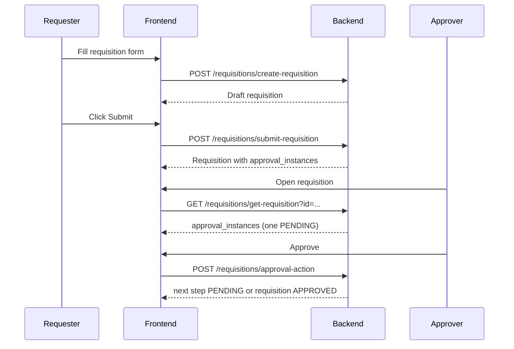

# Requisition Approval Frontend Implementation Guide

## 1. Scope
This guide explains how the frontend should integrate with the new requisition approval configuration and runtime approval flow.

Modules covered:
- Approval config management UI (admin/settings)
- Requisition submit flow (requester)
- Approval action flow (approver)
- Requisition detail/status rendering

## 2. API Endpoints
Base path: `/requisitions`

### 2.1 Save/Update Approval Config
- Method: `POST`
- URL: `/upsert-approval-config`
- Auth: required
- Permission: `can_manage_requisitions`

Request body:
```json
{
  "module": "REQUISITION",
  "requester_user_ids": [12, 25, 31, 44],
  "approvers": [
    { "order": 1, "type": "HEAD_OF_DEPARTMENT" },
    { "order": 2, "type": "POSITION", "position_id": 7 },
    { "order": 3, "type": "SPECIFIC_PERSON", "user_id": 103 }
  ],
  "is_active": true
}
```

### 2.2 Get Approval Config
- Method: `GET`
- URL: `/get-approval-config`
- Auth: required
- Permission: `can_view_requisitions`

### 2.3 Submit Requisition
- Method: `POST`
- URL: `/submit-requisition`
- Auth: required

Request body:
```json
{ "requisition_id": 123 }
```

### 2.4 Approval Action
- Method: `POST`
- URL: `/approval-action`
- Auth: required
- Permission: `can_manage_requisitions`

Request body:
```json
{
  "requisition_id": 123,
  "action": "APPROVE",
  "comment": "Optional note"
}
```

`action` allowed values:
- `APPROVE`
- `REJECT`

## 3. Frontend Data Contracts

### 3.1 Config Types
```ts
type ApproverType = "HEAD_OF_DEPARTMENT" | "POSITION" | "SPECIFIC_PERSON";

type ApprovalStep = {
  order: number;
  type: ApproverType;
  position_id?: number;
  user_id?: number;
};

type RequisitionApprovalConfigPayload = {
  module: "REQUISITION";
  requester_user_ids: number[];
  approvers: ApprovalStep[];
  is_active?: boolean;
};
```

### 3.2 Approval Instance Shape (from requisition detail)
`get-requisition` now returns `approval_instances`.

Use this field for step-by-step UI and current approver logic.

```ts
type ApprovalInstanceStatus = "WAITING" | "PENDING" | "APPROVED" | "REJECTED";

type ApprovalInstance = {
  id: number;
  request_id: number;
  config_id: number;
  step_order: number;
  step_type: ApproverType;
  approver_user_id: number;
  position_id: number | null;
  configured_user_id: number | null;
  status: ApprovalInstanceStatus;
  acted_by_user_id: number | null;
  acted_at: string | null;
  comment: string | null;
};
```

## 4. UI Validation Rules (match backend)
Apply these client-side before submit to reduce failed requests:

- `module` must be `REQUISITION`.
- `requester_user_ids`:
  - non-empty
  - all unique
  - positive integers
- `approvers`:
  - non-empty
  - unique `order`
  - sequential order (1..N)
- Step rules:
  - `HEAD_OF_DEPARTMENT`: must not send `position_id` or `user_id`
  - `POSITION`: must send `position_id` only
  - `SPECIFIC_PERSON`: must send `user_id` only

Also validate that dropdown selections are non-empty and IDs are numeric.

## 5. Recommended Frontend Flows

### 5.1 Admin Config Screen
1. Load config with `GET /get-approval-config`.
2. Bind `requester_user_ids` to multi-select users.
3. Bind `approvers` to ordered step editor.
4. On save, send `POST /upsert-approval-config`.
5. Show backend error messages directly when save fails.

### 5.2 Requester Requisition Flow
Recommended two-stage UX:
1. Save draft requisition (`POST /create-requisition` or `PUT /update-requisition`).
2. Submit with `POST /submit-requisition`.

Why: submit endpoint enforces requester allowlist and builds immutable approval snapshot.

### 5.3 Approver Flow
1. Load requisition details.
2. Find current step:
   - `approval_instances.find(i => i.status === "PENDING")`
3. Show action buttons only if:
   - current step exists
   - `currentStep.approver_user_id === loggedInUser.id`
4. On action:
   - approve -> `POST /approval-action` with `action: "APPROVE"`
   - reject -> `POST /approval-action` with `action: "REJECT"`
5. Refresh requisition details after action.

## 6. Status Rendering Strategy
Do not rely only on `request_approval_status` for multi-step progress.

Use `approval_instances` as source of truth for progression UI:
- Current step: `status === "PENDING"`
- Completed steps: `status === "APPROVED"`
- Blocked future steps: `status === "WAITING"`
- Rejected step: `status === "REJECTED"`

Display global requisition badge from `request_approval_status`:
- `Draft`
- `Awaiting_HOD_Approval` (represents in-progress approval chain)
- `APPROVED`
- `REJECTED`

## 7. Error Handling
Backend returns meaningful `message` text for validation and permission failures.

Frontend rules:
- Show `message` as toast/banner.
- Keep form state on validation failure.
- On `401/403`, show permission/auth prompt.
- On `404`, show not found state and back action.

Common expected errors:
- Requester not allowed by config
- No active config for REQUISITION
- Ambiguous POSITION resolution (multiple active users)
- Missing department or department head
- User not assigned as current pending approver

## 8. UX Recommendations
- Use confirmation modal for reject actions.
- Require reject comment in UI (optional backend, but good UX).
- Show timeline view for `approval_instances` with step order.
- Disable submit button when config likely invalid (if pre-fetched).
- In config screen, auto-normalize order after drag/drop reorder.

## 9. Example Integration Sequence


## 10. Implementation Checklist
- [ ] Add TS models for config + approval action + approval instances.
- [ ] Build config settings page with client-side validator.
- [ ] Add submit button flow using `/submit-requisition`.
- [ ] Add approval action buttons using `/approval-action`.
- [ ] Render step timeline from `approval_instances`.
- [ ] Refresh detail/inbox data after action.
- [ ] Add error toasts for backend `message`.
